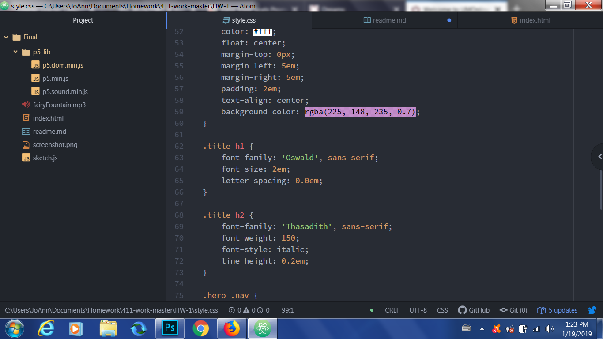

## Week 1 Homework Reflection
---
This week's homework assignment went much more smoothly for me than I
originally anticipated! Having just finished Creative Coding I, I was very
nervous about the coding requirements for this class, because this is not
necessarily my forte. However, working alongside the example material and video
proved to be valuable to my work process.

I was most apprehensive about coding the stle.css document, because I ony vaguely remembered how to do so from Intro to Web Design last year. The provided tutorials however (coupled with some tinkering around on my part) helped me to satisfactorily complete and better understand this section, with surprisingly few speedbumps along the way!

Truthfully, I encountered very few setbacks in my work; when I did, I was able to immediately and effectively solve them. Specifically, I was initially confused with how to code two fonts at the same time. After examining the example code in the html link ref, along with the style.css, I figured out how to do this (and made my life a little bit easier).

## What I did
---
While I feel my html website and code is self-explanatory, I'll give a brief description of how I got there. I wanted to keep it simple, so I decided to squeeze as much (relevant) information about myself as possible into two containers: my "About Me", and "My Interests".
Next, I wanted to represent the concept of myself accurately through my hero images. I chose the one of me and my boyfriend outdoors specifically because I mentioned it in my description as part of what I liked to do; separately, I chose the image of bright yellow tulips, mostly because that's how I see myself (and I sorely miss spring...!)
Ultimately, my choices produced the minimalist, to-the-point  depicition of myself that I sought.

I am eager to continue learning more and move onto the next big project!
